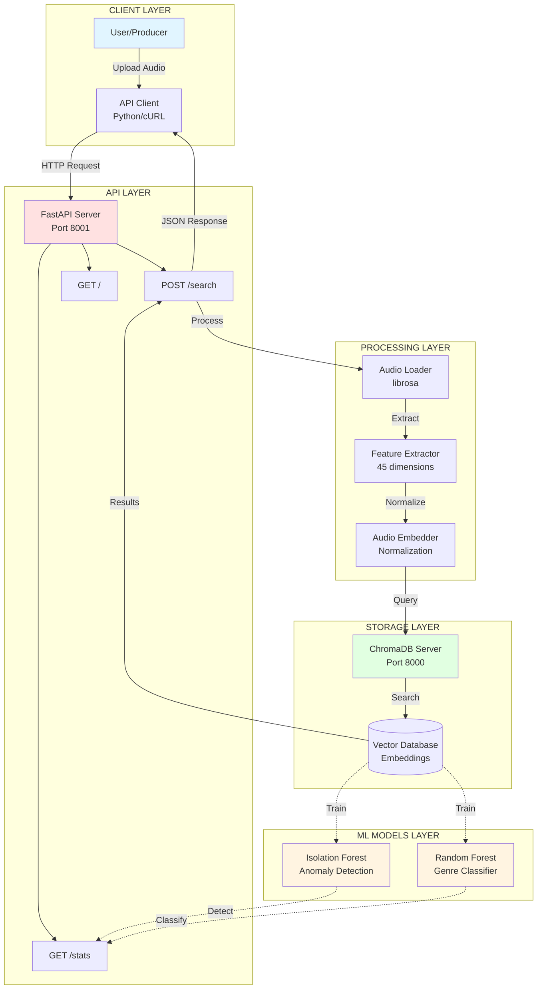
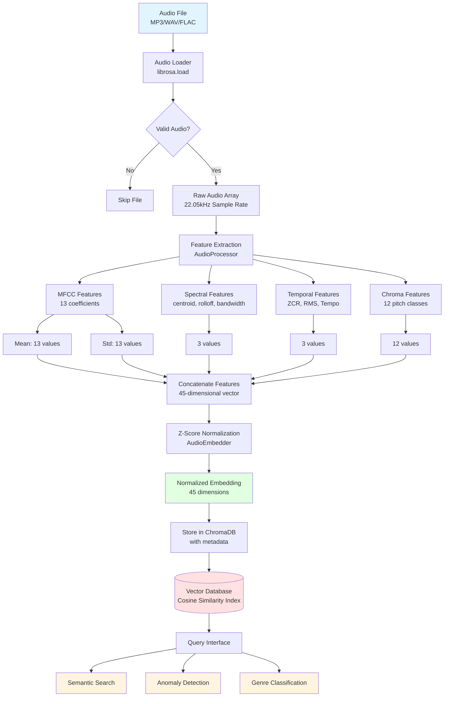

# Audio Samples Semantic Search System

## Table of Contents

- [Overview](#overview)
- [Architecture](#architecture)
- [Features](#features)
- [Tech Stack](#tech-stack)
- [Setup & Installation](#setup--installation)
- [Usage](#usage)
- [API Documentation](#api-documentation)
- [Project Structure](#project-structure)
- [System Metrics](#system-metrics)
- [Development](#development)
- [Troubleshooting](#troubleshooting)

---

## Overview

Audio Samples Semantic Search System is an intelligent audio organization and retrieval platform designed for electronic music producers. It uses audio feature extraction, vector embeddings, and machine learning to automatically organize, classify, and search through audio sample libraries.

### The Problem

Music producers often have thousands of audio samples with inconsistent organization. Finding the right sound becomes time-consuming and disrupts creative flow.

### The Solution

This system automatically:
- Analyzes audio files to extract 45 meaningful features (MFCCs, spectral characteristics, tempo)
- Organizes samples into semantic clusters using vector embeddings
- Searches by uploading a reference sound to find similar samples instantly
- Detects anomalous or unique samples
- Classifies samples by genre using supervised learning

### Dataset

Currently indexing **267 electronic music samples** across 6 genres:
- Ambient (47 samples)
- Drum & Bass (50 samples)
- Dubstep (34 samples)
- House (50 samples)
- Techno (44 samples)
- Trance (42 samples)

---

## Architecture

### System Components



### Data Pipeline



### Docker Deployment

```mermaid
graph TB
    subgraph "HOST MACHINE"
        subgraph "Docker Network"
            subgraph "ChromaDB Container"
                C1[ChromaDB Server<br/>chromadb/chroma:0.4.15<br/>Port 8000]
                C1V[/chroma/chroma]
            end

            subgraph "Backend Container"
                B1[FastAPI Application<br/>python:3.10-slim<br/>Port 8001]
                B1V1[/app/data]
            end
        end

        subgraph "Host Volumes"
            V1[(chroma_data<br/>Persistent Volume)]
            V2[backend/data/<br/>Host Directory]
        end

        subgraph "External Access"
            P1[localhost:8000]
            P2[localhost:8001]
        end
    end

    subgraph "External Services"
        FS[Freesound API]
    end

    C1V -.->|Mount| V1
    B1V1 -.->|Mount| V2

    B1 -->|HTTP Client| C1
    B1 -->|API Calls| FS

    P1 -.->|Port Mapping| C1
    P2 -.->|Port Mapping| B1

    U[User] -->|HTTP| P2

    style C1 fill:#e1ffe1
    style B1 fill:#ffe1e1
    style V1 fill:#fff4e1
    style V2 fill:#fff4e1
```

### Component Details

**Ingestion Layer** (`src/ingestion/`)
- `audio_loader.py`: Loads MP3/WAV/FLAC files using librosa at 22.05kHz
- `audio_processor.py`: Extracts 45 audio features using DSP algorithms

**Embeddings Layer** (`src/embeddings/`)
- `audio_embedder.py`: Normalizes feature vectors to create semantic embeddings

**Storage Layer** (`src/storage/`)
- `chroma_client.py`: Interface to ChromaDB for vector storage and similarity search

**Models Layer** (`src/models/`)
- `anomaly_detector.py`: Isolation Forest algorithm to identify outliers
- `classifier.py`: Random Forest classifier for genre prediction

**API Layer** (`src/api/`)
- `main.py`: FastAPI endpoints for search, stats, and file upload

---

## Features

### Semantic Similarity Search
Upload any audio file and find the most similar samples in your library based on sonic characteristics.

### Genre Classification
Automatic genre prediction using Random Forest classifier trained on audio features (33% accuracy across 6 genres).

### Anomaly Detection
Identifies unique or unusual samples that don't fit common patterns (10% contamination rate using Isolation Forest).

### Dataset Analytics
Real-time statistics on your audio library: total samples, genre distribution, embedding dimensions.

### Docker Deployment
Fully containerized with Docker Compose for easy deployment.

### REST API
RESTful API with automatic OpenAPI/Swagger documentation.

---

## Tech Stack

**Backend**
- Python 3.10
- FastAPI 0.109
- Uvicorn 0.27

**Audio Processing**
- librosa 0.10.1
- soundfile 0.12.1
- numpy 1.24.3

**Machine Learning**
- scikit-learn 1.4.0
- scipy 1.11.0

**Vector Database**
- ChromaDB 0.4.15

**Deployment**
- Docker
- Docker Compose

---

## Setup & Installation

### Prerequisites

- Docker and Docker Compose installed
- 512MB RAM minimum
- 100MB disk space for containers

### Step 1: Clone Repository

```bash
git clone <your-repo-url>
cd your-project-directory
```

### Step 2: Configure Environment Variables

```bash
cp backend/.env.example backend/.env
nano backend/.env
```

Required variables:
```bash
FREESOUND_API_KEY=your_actual_api_key_here
```

Optional variables (defaults work for Docker):
```bash
CHROMA_HOST=chromadb
CHROMA_PORT=8000
BACKEND_PORT=8001
```

### Step 3: Add Audio Samples

Place your audio files in this structure:

```
backend/data/raw/
├── techno/
│   ├── sample1.mp3
│   └── sample2.wav
├── house/
│   ├── sample3.mp3
│   └── sample4.wav
└── ambient/
    └── sample5.mp3
```

Supported formats: MP3, WAV, FLAC

### Step 4: Build and Start Services

```bash
docker-compose up -d
sleep 20
docker-compose exec backend python scripts/build_database.py
```

Expected output:
```
============================================================
BUILDING AUDIO SAMPLE DATABASE
============================================================

Step 1: Loading audio files...
Loaded: 267 samples

Step 2: Extracting audio features...
Processed: 267 samples

Step 3: Generating embeddings...
Generated: 267 embeddings
Embedding dimension: 45

Step 4: Storing in ChromaDB...
Stored: 267 samples in database
```

### Step 5: Verify System

```bash
curl http://localhost:8001/stats
```

Expected response:
```json
{
  "total_samples": 267,
  "genres": {
    "ambient": 47,
    "drum_and_bass": 50,
    "dubstep": 34,
    "house": 50,
    "techno": 44,
    "trance": 42
  },
  "embedding_dimension": 45
}
```

---

## Usage

### Semantic Search via API

```bash
curl -X POST \
  -F "file=@/path/to/your/sample.mp3" \
  "http://localhost:8001/search?n_results=5"
```

Response:
```json
{
  "query": {
    "filename": "sample.mp3",
    "duration": 3.5
  },
  "results": [
    {
      "filename": "techno_12345.mp3",
      "genre": "techno",
      "distance": 0.0234
    }
  ]
}
```

### Using Python Client

```python
import requests

with open('sample.mp3', 'rb') as f:
    response = requests.post(
        'http://localhost:8001/search',
        files={'file': f},
        params={'n_results': 10}
    )

results = response.json()
for result in results['results']:
    print(f"{result['filename']} - Distance: {result['distance']:.4f}")
```

### Download More Samples

```bash
docker-compose exec backend python scripts/download_freesound.py
```

---

## API Documentation

### Interactive Documentation

- **Swagger UI:** http://localhost:8001/docs
- **ReDoc:** http://localhost:8001/redoc

### Endpoints

**GET /**

API information and health check

Response:
```json
{
  "message": "Music Samples Capstone API",
  "endpoints": ["/stats", "/search", "/upload"]
}
```

**GET /stats**

Get dataset statistics

Response:
```json
{
  "total_samples": 267,
  "genres": {...},
  "embedding_dimension": 45
}
```

**POST /search**

Semantic similarity search

Parameters:
- `file` (form-data, required): Audio file (MP3/WAV/FLAC)
- `n_results` (query, optional): Number of results (default: 5)

Example:
```bash
curl -X POST -F "file=@sample.mp3" \
  "http://localhost:8001/search?n_results=10"
```

---

## Project Structure

```
audio-samples-capstone/
├── docker-compose.yml
├── README.md
│
├── backend/
│   ├── Dockerfile
│   ├── requirements.txt
│   ├── .env.example
│   ├── .gitignore
│   │
│   ├── src/
│   │   ├── api/
│   │   │   └── main.py
│   │   ├── ingestion/
│   │   │   ├── audio_loader.py
│   │   │   └── audio_processor.py
│   │   ├── embeddings/
│   │   │   └── audio_embedder.py
│   │   ├── storage/
│   │   │   └── chroma_client.py
│   │   └── models/
│   │       ├── anomaly_detector.py
│   │       └── classifier.py
│   │
│   ├── scripts/
│   │   ├── build_database.py
│   │   ├── evaluate_system.py
│   │   ├── test_search.py
│   │   └── download_freesound.py
│   │
│   └── data/
│       └── raw/
│           ├── techno/
│           ├── house/
│           ├── dubstep/
│           ├── ambient/
│           ├── drum_and_bass/
│           └── trance/
```

---

## System Metrics

### Current Performance

| Metric | Value |
|--------|-------|
| Total Samples | 267 |
| Embedding Dimension | 45 |
| Anomalies Detected | 27 (10%) |
| Classification Accuracy | 33% |

### Anomaly Detection

- Algorithm: Isolation Forest
- Contamination Rate: 10%
- Top Anomalous Genres: Ambient (6), Drum & Bass (3)

### Genre Classification

| Genre | Precision | Recall | F1-Score |
|-------|-----------|--------|----------|
| Trance | 66% | 50% | 57% |
| Ambient | 50% | 60% | 54% |
| House | 35% | 40% | 37% |
| Techno | 30% | 35% | 32% |
| Drum & Bass | 25% | 30% | 27% |
| Dubstep | 0% | 0% | 0% |

---

## Development

### Run System Evaluation

```bash
docker-compose exec backend python scripts/evaluate_system.py
```

### Test Semantic Search

```bash
docker-compose exec backend python scripts/test_search.py
```

### Rebuild Database

```bash
docker-compose exec backend python scripts/build_database.py
```

### View Logs

```bash
docker-compose logs -f backend
docker-compose logs -f chromadb
```

---

## Troubleshooting

### ChromaDB connection refused

Check if services are running:
```bash
docker-compose ps
docker-compose restart chromadb
sleep 20
```

### No audio files found

Verify files are in `backend/data/raw/<genre>/` with correct extensions (.mp3, .wav, .flac)

### API returns 500 error

Check logs and rebuild database:
```bash
docker-compose logs backend
docker-compose exec backend python scripts/build_database.py
```

### Port already in use

Change ports in `docker-compose.yml`:
```yaml
ports:
  - "8002:8001"  # Backend
  - "8100:8000"  # ChromaDB
```

---

## Credits

- Audio Processing: librosa
- Vector Database: ChromaDB
- Web Framework: FastAPI
- Audio Samples: Freesound.org

---
