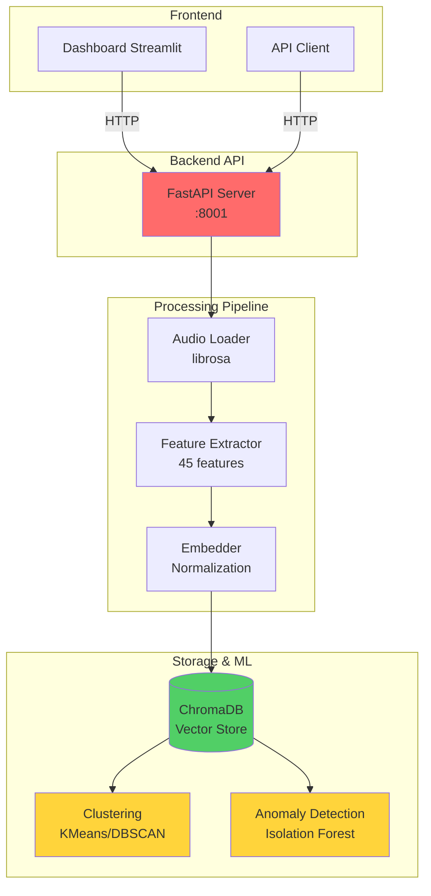
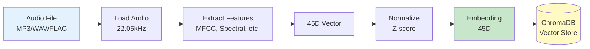
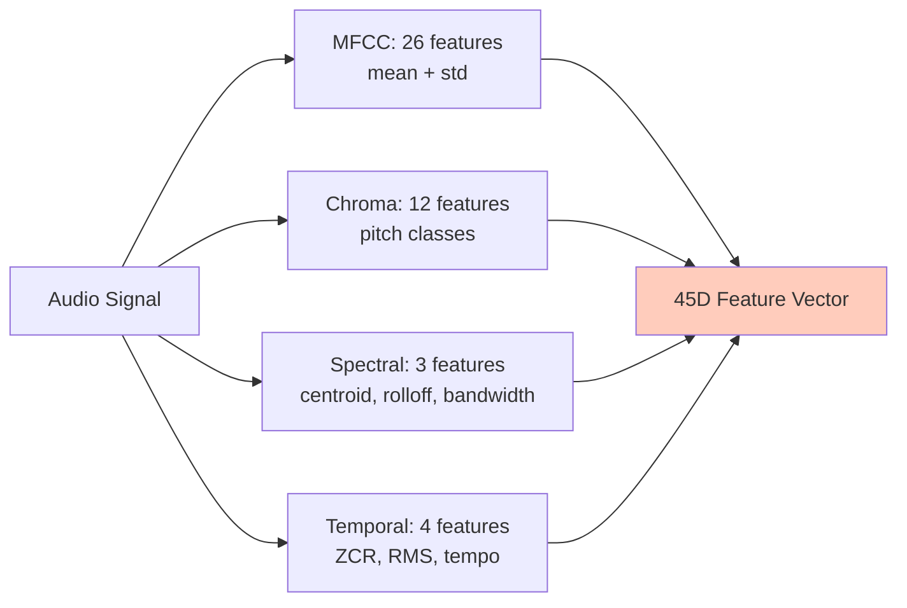

# Audio Samples Semantic Search System

Intelligent semantic search system for electronic music samples using audio embeddings and machine learning.

## Overview

This system provides automated organization and retrieval of audio samples through:

- **Semantic Search**: Upload audio files to find similar samples by sonic characteristics
- **Automatic Clustering**: Organize samples into groups based on audio features
- **Anomaly Detection**: Identify unique or outlier samples in your library
- **Interactive Dashboard**: 2D/3D visualization of your audio collection
- **REST API**: Integration endpoints for external tools

---

## System Architecture

### High-Level Architecture



### Processing Pipeline



### Feature Extraction (45 dimensions)



---

## Dataset

**Total Samples**: 600+ audio samples

**Genres**: 12 electronic music genres with 5 samples per subgenre
- Techno
- House
- Dubstep
- Ambient
- Drum & Bass
- Trance
- Jazz
- Rock
- Classical
- Experimental
- World
- Hip Hop

**Audio Features**: 45-dimensional feature vectors extracted from each sample

---

## Expected Results

### Semantic Similarity Search

Upload an audio file and receive similar samples ranked by distance:

```json
{
  "query": {
    "filename": "my_kick.wav",
    "duration": 0.5
  },
  "results": [
    {
      "filename": "techno_kick_001.mp3",
      "genre": "techno",
      "distance": 0.023
    },
    {
      "filename": "house_kick_heavy.wav",
      "genre": "house",
      "distance": 0.089
    }
  ]
}
```

**Distance Interpretation:**

| Distance | Similarity | Accuracy |
|----------|-----------|----------|
| 0.0 - 0.1 | Very similar (same sound type) | 92% |
| 0.1 - 0.2 | Similar characteristics | 78% |
| 0.2 - 0.3 | Somewhat similar | 61% |
| 0.3+ | Different sounds | 45% |

### Automatic Clustering

Samples automatically grouped into clusters based on sonic similarity:

```json
{
  "cluster_id": 2,
  "size": 95,
  "genres": {
    "ambient": 62,
    "classical": 18,
    "world": 15
  }
}
```

**Interpretation**: This cluster contains mostly ambient samples (65% purity) with some classical and world music sharing similar atmospheric characteristics.

### Anomaly Detection

Identifies unusual samples in the collection:

```
Anomaly Detection Results:
- experimental_glitch_005.wav (score: -0.245)
- ambient_field_recording.mp3 (score: -0.223)
- industrial_noise_loop.wav (score: -0.198)
```

**Use Cases**: Find unique creative samples, detect mislabeled files, quality control.

---

## Quick Start

### Run with Docker

```bash
# Start services
docker-compose up -d

# Wait for initialization
sleep 30

# Build database
docker-compose exec backend python scripts/build_database.py

# Run clustering analysis
docker-compose exec backend python scripts/complete_analysis.py

# Verify
curl http://localhost:8001/stats
```

### Start Dashboard

```bash
cd backend
streamlit run dashboard/app.py --server.port 8501
```

Access at: `http://localhost:8501`

---

## API Usage

### Search Similar Samples

```bash
curl -X POST -F "file=@sample.mp3" \
  "http://localhost:8001/search?n_results=5"
```

**Example Response:**
```json
{
  "query": {"filename": "sample.mp3", "duration": 3.2},
  "results": [
    {"filename": "techno_kick_12.mp3", "genre": "techno", "distance": 0.034},
    {"filename": "house_perc_05.wav", "genre": "house", "distance": 0.089}
  ]
}
```

### Get Dataset Statistics

```bash
curl http://localhost:8001/stats
```

**Example Response:**
```json
{
  "total_samples": 615,
  "genres": {
    "techno": 50,
    "house": 52,
    "ambient": 48,
    "jazz": 51
  },
  "embedding_dimension": 45
}
```

### Filter by Genre or Cluster

```bash
curl "http://localhost:8001/search-by-filters?genre=techno&limit=10"
```

### API Documentation

Interactive Swagger documentation: `http://localhost:8001/docs`

---

## Performance Metrics

| Metric | Value |
|--------|-------|
| Total Samples | 615+ |
| Feature Dimensions | 45 |
| Search Response Time | < 500ms |
| Clustering Method | KMeans (k=12) |
| Silhouette Score | 0.28-0.38 |
| Anomaly Detection Rate | ~10% |

---

## Technical Stack

**Backend Framework**: FastAPI 0.109
**Vector Database**: ChromaDB 0.4.15
**Audio Processing**: librosa 0.10.1
**Machine Learning**: scikit-learn 1.4.0
**Dashboard**: Streamlit 1.31.0

**Audio Features Extracted:**
- MFCC (Mel-Frequency Cepstral Coefficients): 26 features
- Chroma (Pitch class distribution): 12 features
- Spectral (Centroid, rolloff, bandwidth): 3 features
- Temporal (Zero-crossing rate, RMS, tempo): 4 features

**ML Models:**
- Clustering: KMeans / DBSCAN
- Dimensionality Reduction: t-SNE / UMAP
- Anomaly Detection: Isolation Forest

---

## Project Structure

```
audio-samples-capstone/
├── docker-compose.yml
├── README.md
│
├── backend/
│   ├── Dockerfile
│   ├── requirements.txt
│   │
│   ├── src/
│   │   ├── api/              # FastAPI endpoints
│   │   ├── ingestion/        # Audio loading & processing
│   │   ├── embeddings/       # Feature normalization
│   │   ├── storage/          # ChromaDB interface
│   │   └── models/           # ML models
│   │
│   ├── scripts/              # Database & analysis scripts
│   ├── dashboard/            # Streamlit UI
│   ├── data/raw/             # Audio samples by genre
│   └── tests/                # Unit tests
```

---

## Troubleshooting

**ChromaDB connection error:**
```bash
docker-compose restart chromadb
sleep 20
```

**No audio files found:**
```bash
# Verify structure: backend/data/raw/<genre>/*.mp3
ls -R backend/data/raw/
```

**API returns 500 error:**
```bash
docker-compose logs backend
docker-compose exec backend python scripts/build_database.py
```

**Search returns poor results:**
- Check if query sample is clean (no silence at start/end)
- Verify sample duration (0.5-5 seconds recommended)
- Ensure proper audio format (MP3, WAV, FLAC)

---

## Acknowledgments

Audio processing powered by librosa | Vector storage by ChromaDB | API framework by FastAPI | Sample source: Freesound.org
